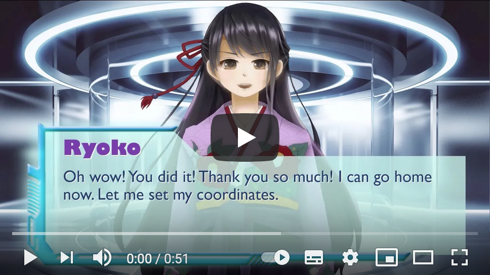
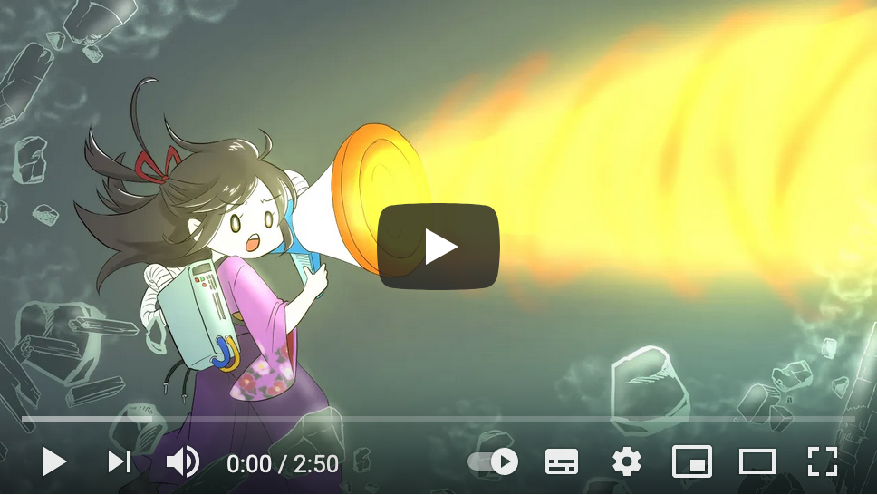
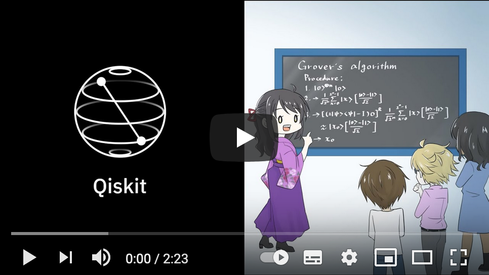

<!-- -->
# Welcome to IBM Quantum Challenge!
[日本語はこちら](#ibm-quantum-challengeへようこそ)<br/>
[한글은 여기](#ibm-quantum-challenge환영합니다)<br/>

## Thank you! We have completed this challenge on Nov 30th, 2020.

## Leaderboard
The [Leaderboard](./solutions/leaderboard.md) shows the top ten scores and standings of contestants who have submitted their code to the final exercise.

## How to Solve the Final Exercise
[Sample solutions](./solutions/week-3/ex_3_solution_en.ipynb): Example solution to the final exercise with honorary mentions to the top three scorers by our judges.

## Top Scorers’ Solutions
[Top Scorers’ Solutions](https://github.com/qiskit-community/IBMQuantumChallenge2020/tree/main/submissions): How did the top scorers tackle this problem? Check out their unique and excellent solutions.


## The Story behind IBM Quantum Chellenge
You can explore each story behind the adventure of Dr. Ryoko.

|[Episode 1](https://youtu.be/eLw7fWb2xv4) |[Episode 2](https://youtu.be/f8TEd_51rHI) |[Episode 3](https://youtu.be/kLizHnvTguE)|[Episode 4](https://youtu.be/25PcR5Pn4hk) | [Episode 5](https://youtu.be/Bkk5-j6rpoM) |[Episode 6](https://youtu.be/EC2Dc1QgLZY) |
| --- | --- | --- | --- | --- | --- |
|   |   |   |  |   |  |
<br/>

## IMPORTANT : [Final exercise submission rules](#final-exercise-submission-rules)


## Hello, quantum world.

As we approach the end of 2020, we would like to engage the community with new exciting set of challenges, and further push limits of our quantum systems to achieve another yet significant milestone. 

Our first competitive coding contest [IBM Quantum Challenge](https://ibmquantum.angelhack.com/)  was held in November 2019, attracting both seasoned coders and newbies from all over the world to start their journey in Quantum Computing.
In May 2020, we celebrated our fourth anniversary of IBM Quantum Experience with another Challenge where 1,745 people from 45 countries came together to solve four problems making total use of the 18 IBM Quantum systems on the IBM Cloud exceeding 1 billion circuits a day. 

Starting Nov 9th at 9am JST, we present you with three weeks of new challenges that will help grow your knowledge, skills, and understanding of quantum computing and Qiskit to tackle problems using some well-known quantum algorithms.

In recognition of your participation, we are awarding digital badges to those who complete all exercises.

Note that participation is allowed for those who have applied and received official confirmation from the challenge organizers only. 

## Programming Environment
IBM Quantum Challenge will be hosted on IBM Quantum Experience (a.k.a. IQX). IQX allows you to build, execute and evaluate your quantum circuits within a self-contained Jupyter notebook environment without downloading anything to your computer.

On Nov 9, 2020 when the challenge site opens, participants will see a set of exercises hosted in this self-contained Jupyter notebook environment where you can write and run your code directly from and make submissions of your answers.

Please note that the challenge site with exercises hosted in this Jupyter notebook environment is only accessible by applicants who confirmed participation upon receiving a confirmation email from the event organizers.

## Preparation
In many cases, you may prefer to run your code locally when working on the exercises before you make your submission in the IBM Quantum Experience environment. In such case, you will need to install **Qiskit** to your computer. Qiskit is a Python based opensource framework for working with quantum computers at the level of pulses, circuits, and algorithms. Please see the [Qiskit.org](https://qiskit.org) page for more details.

Qiskit can be installed by using *pip*:

```
$ pip install qiskit
```

Please check out [Install Qiskit](https://qiskit.org/documentation/install.html) or [YouTube video](https://www.youtube.com/watch?v=M4EkW4VwhcI) for a step by step installaion guide.

## Challenge Index
The challenge content has been shared with the public on the following dates.<br/>

| Week  | Challenge | Message from Dr. Ryoko |　Available on (JST) |
| ---     | ---    | --- |  --- |
| Week 0 |[For Beginners: The atoms of computation](exercises/week-0/ex_0_en.ipynb) | [Episode 1](https://youtu.be/eLw7fWb2xv4) |Now Live |
| Week 1 |[Learning Challenge Exercise I-A](https://github.com/qiskit-community/IBMQuantumChallenge2020/blob/iqx/exercises/week-1/ex_1a_en.ipynb) <br/>[Learning Challenge Exercise I-B](https://github.com/qiskit-community/IBMQuantumChallenge2020/blob/iqx/exercises/week-1/ex_1b_en.ipynb)|  [Episode 2](https://youtu.be/f8TEd_51rHI) | Nov 9th 2020 |
| Week 2  |[Learning Challenge Exercise II-A](https://github.com/qiskit-community/IBMQuantumChallenge2020/blob/main/exercises/week-2/ex_2a_en.ipynb) <br/>[Learning Challenge Exercise II-B](https://github.com/qiskit-community/IBMQuantumChallenge2020/blob/main/exercises/week-2/ex_2b_en.ipynb)| [Episode 3](https://youtu.be/kLizHnvTguE), [Episode 4](https://youtu.be/25PcR5Pn4hk) | Nov 16th 2020 |
| Week 3  |[Final Challenge](https://github.com/qiskit-community/IBMQuantumChallenge2020/blob/main/exercises/week-3/final_en.ipynb) | [Episode 5](https://youtu.be/Bkk5-j6rpoM), [Episode 6](https://youtu.be/EC2Dc1QgLZY) | Nov 23rd 2020 |
 <br/>


## Final Exercise Submission Rules
For valid submissions we ask that your solution adheres to the below rule.<br/>
* Please implement the quantum circuit within **28 qubits**.
* Use Grover's algorithm you learned in Week1 & 2 with **iteration ＝ 1**.
* The initial state for Grover's algorithm must be equal probability distributions. For example, if you want use only 3 computational bases for 2 qubits instead of 4 as the initial state. Then, the state will be sqrt(1/3)(|00⟩+|01⟩+|11⟩).
* Please note that you can get the answer with the same endian as the one used in Week2 explanation. You should map the index of the problem into four classical registers c[0:4] in binary. c[0] is the highest bit and c[3] is the lowest bit. For example, when mapping 12, the furthest left bit of 1100 will be mapped to c[0].
* Make sure you **create an oracle** that **doesn't require knowledge of what the answers are**. (For example, you are not allowed to create an oracle by using a classical optimization solver to get your answers for it.)  
With the exception of the Unroller, which is required for decomposing your circuit to calculate quantum costs, you are not allowed to use any existing transpiler passes nor original transpilers for making simplifications in this competition.
* Please **do not run jobs in succession** even if you are concerned that your job is not running properly. This can create a long queue and clog the backend. You can check whether your job is running properly at: https://quantum-computing.ibm.com/results  
* Your score for this exercise will be same as the cost of your QuantumCircuit. The lower the cost, the better.
* Judges will check top 10 solutions manually to see if the solutions adhere to the rules. **Please note that your ranking is subject to change after the challenge period as a result of the judging process**. 
* Top 10 participants will be recognized and asked to submit a write up on how they solved the exercise.
* **When mapping the board information into your quantum circuit, you must not change the board information from the original one. (i.e. Do not rearrange the asteroid positions, nor rotate, invert, swap rows and columns.)** 
<br/>


--------------------------------
# IBM Quantum Challengeへようこそ！
## 当コンテストは2020年11月30日に終了しました。
## 順位表
[順位表](./solutions/leaderboard.md): ファイナルチャレンジのトップ10のランキング表です。

## 最終問題の解法解説
[最終問題解説](./solutions/week-3/ex_3_solution_ja.ipynb):ジャッジによる最終問題の解法例です。競技者の皆さんの独創的で素晴らしい解法↓↓↓もぜひチェックしてください。

## トップ10の解法解説
[トップの解法解説](https://github.com/qiskit-community/IBMQuantumChallenge2020/tree/main/submissions): トップ10にランキングした皆さんが最終問題にどう挑んだのか。アプローチ、駆使したテクニックなどを公開しています。

## 重要：[最終問題の提出ルール](#final-exercise-submission-rules)<br/>

<br/>
2020年も終わりに近づいてまいりましたが、量子コンピューティングの世界の新たな挑戦にご案内したいと思います。皆さんで一緒に量子の世界の新たなマイルストーンを達成しましょう！

2019年11月に初めて開催した[IBM Quantum Challenge](https://ibmquantum.angelhack.com/)では、量子情報の専門家から初心者の方まで多くの方にご参加いただきました。[IBM Qunatum Experience](https://quantum-computing.ibm.com/)誕生から4周年を祝して開催された2020年5月のIBM Quantum Challengeでは、45ヶ国から1745人の方が参加し、期間中に、18台のIBMの量子コンピューターシステムにおいて、1日に10億回の量子回路の計算が実行されました。

11月9日午前9時(日本時間)に開催される今回のChallengeは、３週間のChallengeです。ともに、量子コンピューターの知識・スキルを深め、Exercise問題に取り組んでまいりましょう。

すべてのExercisesにおいて正解を提出できた方にDigital badgeをお送りします。

応募フォーム（Application Form）を完了し、Challenge事務局から確認メール（Confirmation Required)を受領し参加確認を行った方のみ、Challengeに参加可能です。


## プログラミング環境
IBM Quantum ExperienceではPythonベースのオープンソースの量子開発フレームワークである**Qiskit**を利用します。

11月9日（月）のチャレンジ開始と同時に、参加者はIQXの専用サイトから、ホスティングされているJupyter Notebook内の問題を閲覧することが可能になります。参加者は自身のコンピュータにはQiskitをインストールすることなく、同ホスティング環境にてコードを記述、実行し、回答を提出することができます。

注）当ChallengeのIQX上の専用サイトは事前登録を済ませたのち、Challenge事務局からの確認メール（Confirmation Required)にて参加確認を行った方のみアクセス可能になります。予めご了承ください。


## 事前準備
Challengeで出題されるExercise問題に取り組む際、すべてをIQX上で実行する前に、コードの作成や実行をローカルで試したい方もいらっしゃるでしょう。そういう場合のために、ご自身のパソコン環境にQiskitをインストールしておくことをお勧めします。Qiskitは量子コンピューターを使うためのPythonのオープンソース フレームワークです。パルスや回路、アルゴリズムといった様々なレイヤーで活用することができます。Qiskitの詳細は[Qiskit.org](https://qiskit.org)のページを参照して下さい。

Qiskitは *pip* を用いてインストールできます。

```
$ pip install qiskit
```
インストールの詳細な手順については[Qiskitのインストール](https://qiskit.org/documentation/locale/ja/install.html)または[インストール動画](https://www.youtube.com/watch?v=M4EkW4VwhcI)を参照してください。

## チャレンジ内容
毎週以下の日付にそれぞれのチャレンジ内容を更新します。<br/>

| ウィーク |  チャレンジ | Dr.リョウコからのメッセージ  |　 更新日 |
| ---     | ---    | --- |  --- |
| Week 0 |[初心者向け:量子計算の基礎](exercises/week-0/ex_0_ja.ipynb) | [Episode 1](https://youtu.be/eLw7fWb2xv4) | 公開済み |
| Week 1 |[ラーニングチャレンジ演習 I-A](https://github.com/qiskit-community/IBMQuantumChallenge2020/blob/iqx/exercises/week-1/ex_1a_ja.ipynb) <br/>[ラーニングチャレンジ演習 II-B](https://github.com/qiskit-community/IBMQuantumChallenge2020/blob/iqx/exercises/week-1/ex_1b_ja.ipynb)|  [Episode 2](https://youtu.be/f8TEd_51rHI) | Nov 9th 2020 |
| Week 2  |[ラーニングチャレンジ演習 II-A](https://github.com/qiskit-community/IBMQuantumChallenge2020/blob/main/exercises/week-2/ex_2a_ja.ipynb) <br/>[ラーニングチャレンジ演習 II-B](https://github.com/qiskit-community/IBMQuantumChallenge2020/blob/main/exercises/week-2/ex_2b_ja.ipynb)| [Episode 3](https://youtu.be/kLizHnvTguE), [Episode 4](https://youtu.be/25PcR5Pn4hk) | Nov 16th 2020 |
| Week 3  |[ファイナルチャレンジ(本戦)](https://github.com/qiskit-community/IBMQuantumChallenge2020/blob/main/exercises/week-3/final_ja.ipynb) | [Episode 5](https://youtu.be/Bkk5-j6rpoM), [Episode 6](https://youtu.be/EC2Dc1QgLZY) | Nov 23rd 2020 |


--------------------------------
# ibm-quantum-challenge환영합니다！
## Thank you! We have completed this challenge on Nov 30th, 2020.
## 중요 : [최종 과제 제출 규칙](#final-exercise-submission-rules)<br/>

2020년 말이 다가오는 시점에 커뮤니티 여러분을 위해 양자 시스템의 한계를 뚫고 나아가 새로운 이정표를 달성할 수 있는 새롭고 흥미 진진한 챌린지를 준비했습니다.

2019년 11월에 처음으로 시작된 [IBM Quantum Challenge](https://ibmquantum.angelhack.com/)는 전 세계의 많은 개발자들과 입문자들을 양자컴퓨터로의 여정으로 인도했습니다. 그리고 2020년 5월, IBM Quantum Experience의 4주년을 기념하여 열린 [IBM Qunatum Experience](https://quantum-computing.ibm.com/)에서 총 45개국에서 온 1745명의 참가자들은 4개의 문제를 풀기 위해 IBM 클라우드를 통해 총 18개의 IBM Quantum systems을 사용하여, 하루 기준 10억 개의 양자 회로 연산 수행 기록을 달성했습니다.

돌아오는 11월 9일 오전 9시부터, 몇 가지의 잘 알려진 양자 알고리즘을 사용해 양자컴퓨팅과 Qiskit에 대한 지식과 기술을 높일 수 있는 과제가 준비되어 있는 3주간의 새로운 챌린지가 시작됩니다.

연습문제를 모두 성공적으로 완료한 참가자에게는 디지털 배지가 수여됩니다.

참가 신청 후 주최 측으로 부터 참가에 대한 공식 확인을 받아야 참가가 가능한 점에 유의하세요.


## 코딩 환경
IBM Quantum Challenge는 IBM Quantum Experience (일명 IQX)에서 진행됩니다. IQX를 사용하는 경우 개인 컴퓨터에 라이브러리나 파일을 다운로드 하거나 설치할 필요 없이 IQX에 자체 포함 된 Jupyter 노트북 환경에서 양자 회로를 구성, 실행하고 도전 과제를 평가받을 수 있습니다.

2020 년 11 월 9 일 챌린지 사이트가 열리면 참가자는 코드를 직접 작성하고 실행하고 답변을 제출할 수있는이 독립형 Jupyter 노트북 환경에서 연습 문제를 풀고 제출하게 됩니다.

연습 문제에 도전할 수 있는 Jupyter notebook 작업 공간은 주최 측으로 부터 공식 참가 확인 이메일을 받고 참여가 확정된 참가자만이 접근 가능한 점에 꼭 유의하세요.


## 준비사항
IBM Quantum Experience 환경에서 연습 문제의 정답을 제출하기 전에 개인 작업 환경(개인 노트북 및 컴퓨터의 로컬 환경)에서 미리 실습해 보고 싶을 수 있습니다. 이 경우 컴퓨터에 **Qiskit**을 설치해야합니다. Qiskit은 펄스, 회로 및 알고리즘 수준에서 양자 컴퓨터 작업을위한 Python 기반 오픈 소스 프레임 워크입니다. 자세한 내용은 [Qiskit.org](https://qiskit.org) 페이지를 참조하십시오.


*pip*를 사용하여 Qiskit을 간단하게 설치할 수 있습니다.

```
$ pip install qiskit
```
자세한 내용은 [Install Qiskit](https://qiskit.org/documentation/install.html)이나 [YouTube video](https://www.youtube.com/watch?v=M4EkW4VwhcI) 를 참고하세요.

## 도전 순서
도전 과제는 다음의 날짜에 공개됩니다.<br/>
| Week  | 도전 과제 | 료코 박사의 메시지 |　Available on (KST) |
| ---     | ---    | --- |  --- |
| Week 0 |[초보자 대상: 양자 컴퓨팅의 기초](exercises/week-0/ex_0_ko.ipynb) | [Episode 1](https://youtu.be/eLw7fWb2xv4) | 도전 가능 |
| Week 1 |[도전 과제 I-A](exercises/week-1/ex_1a_ko.ipynb) <br/>[도전 과제 I-B](exercises/week-1/ex_1b_ko.ipynb)|  [Episode 2](https://youtu.be/f8TEd_51rHI) | 도전 가능 |
| Week 2  |[도전 과제 II-A](exercises/week-2/ex_2a_ko.ipynb) <br/>[도전 과제 II-B](exercises/week-2/ex_2b_ko.ipynb)| [Episode 3](https://youtu.be/kLizHnvTguE), [Episode 4](https://youtu.be/25PcR5Pn4hk) | 도전 가능 |
| Week 3  |[최종 과제](exercises/week-3/final_ko.ipynb) | [Episode 5](https://youtu.be/Bkk5-j6rpoM), [Episode 6](https://youtu.be/EC2Dc1QgLZY) | 도전 가능 |
